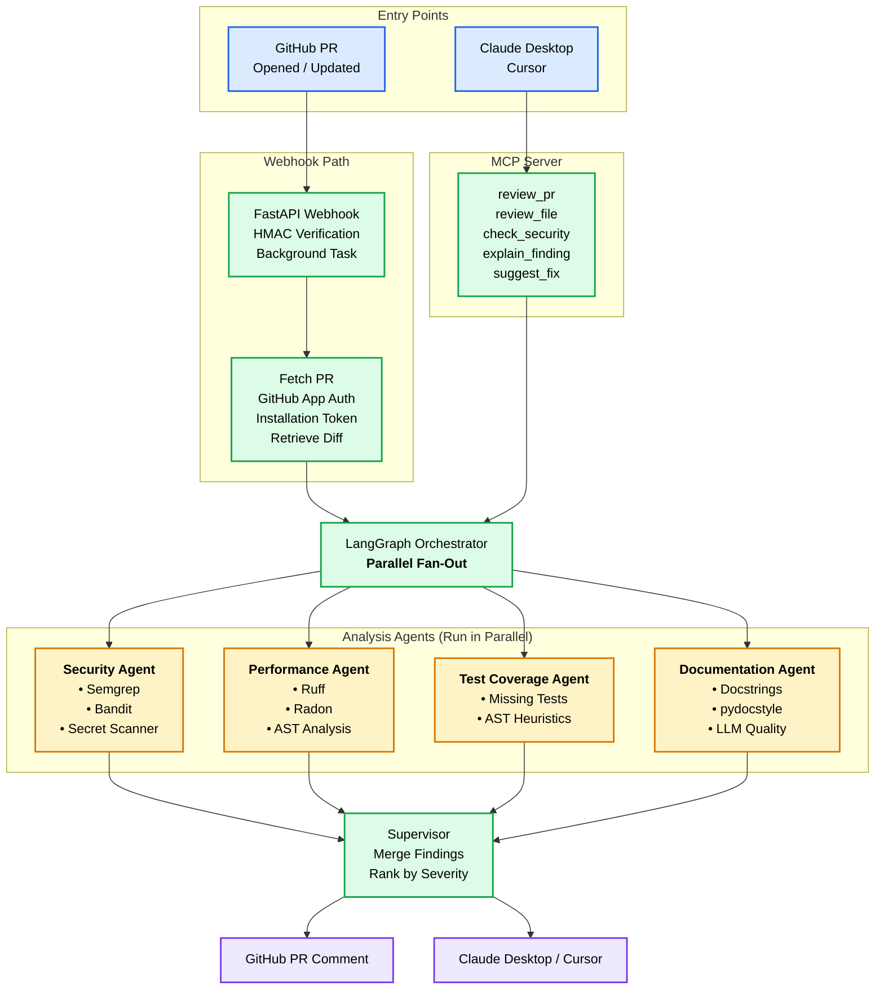

# Multi-Agent Code Review & PR Analysis System


Automated PR review using four specialized AI agents — security, performance, test coverage, and documentation — orchestrated in parallel via LangGraph. Installable as a GitHub App that reviews PRs automatically, or usable interactively through Claude Desktop and Cursor via a bundled MCP server.

## Why This Exists

Code reviews are slow, inconsistent, and important issues — security vulnerabilities especially — get missed under time pressure. This system runs four specialized checks concurrently and synthesizes the results into one ranked, deduplicated review, either automatically on every PR or on-demand from an IDE.

# Architecture



Each specialist agent follows the same internal pattern: deterministic tools are force-executed (never skipped, never left to LLM discretion), their raw output is combined, and an LLM synthesis step converts that combined output into structured, severity-ranked findings. Both entry points — the GitHub webhook and the MCP server — call into the exact same agent and orchestration code; there is no duplicated logic between them.

## Features

- **Security Agent** — Semgrep, Bandit, and a custom secret-pattern scanner, with a deterministic severity-override layer that corrects for LLM batch-relative severity bias on well-known vulnerability classes (e.g. SQL injection is always floored at HIGH, regardless of how a batch of other findings might otherwise skew the model's judgment).
- **Performance Agent** — Ruff (linting), Radon (cyclomatic complexity), and a custom AST-based N+1 query pattern detector.
- **Test Coverage Agent** — heuristic missing-test detection via function-to-test naming convention analysis, checking for a correspondingly-named test function for each new function added in a PR.
- **Docs Agent** — docstring presence (AST-based), style compliance (pydocstyle), and LLM-judged docstring *quality* — the only check in the system where semantic LLM judgment is the primary mechanism rather than a deterministic tool wrapper, since no static tool can assess whether a docstring is actually accurate or useful.
- **Parallel agent execution** via LangGraph's fan-out/fan-in graph — all four agents run concurrently rather than sequentially, with a measured ~1.6x speedup in testing (bounded by the slowest individual agent's tool latency, not the sum of all four).
- **MCP server** — five tools (`review_pr`, `review_file`, `check_security`, `explain_finding`, `suggest_fix`) exposing the same underlying agent logic to Claude Desktop and Cursor, with zero duplicated logic between the MCP layer and the webhook-driven pipeline.
- **GitHub App** — JWT-based App authentication with short-lived, per-installation access tokens (not a personal access token), installable on any repository with scoped permissions.

## Quick Start

### Prerequisites
- Python 3.12+
- [Semgrep](https://semgrep.dev/docs/getting-started/), Bandit, Ruff, Radon, and pydocstyle installed and on `PATH`
- An OpenAI API key
- A GitHub Personal Access Token (for local testing) or a registered GitHub App (for production use)

### Local setup

```bash
git clone <this-repo>
cd pr-review-agents
python -m venv .venv
.venv\Scripts\activate        # Windows
pip install -r requirements.txt
```

Create a `.env` file:

```
OPENAI_API_KEY=sk-...
GITHUB_TOKEN=ghp_...
GITHUB_WEBHOOK_SECRET=your_chosen_secret
GITHUB_APP_ID=your_app_id
GITHUB_APP_PRIVATE_KEY_PATH=./your-app.private-key.pem
```

### Running the webhook server locally

```bash
uvicorn src.webhook.app:app --port 8000 --reload
```

Use [ngrok](https://ngrok.com/) to expose it publicly for testing against a real GitHub webhook:

```bash
ngrok http 8000
```

### Running the MCP server

```bash
mcp dev mcp/server.py
```

This opens the MCP Inspector for manual tool testing. For Claude Desktop integration, add an entry to `claude_desktop_config.json` pointing at `mcp/server.py`, using the **full path to your virtual environment's `python.exe`** rather than a bare `python` command.

### Running tests

```bash
pytest -v
```

### Docker

```bash
docker build -t pr-review-agents:latest .
docker run -p 8000:8000 \
  -e OPENAI_API_KEY=your_key \
  -e GITHUB_APP_ID=your_app_id \
  -e GITHUB_WEBHOOK_SECRET=your_secret \
  -v "/path/to/your-app.private-key.pem:/app/key.pem" \
  -e GITHUB_APP_PRIVATE_KEY_PATH=/app/key.pem \
  pr-review-agents:latest
```

## Tech Stack

**AI/Agent orchestration:** LangChain, LangGraph, MCP SDK, OpenAI (GPT-4.1-mini)
**Static analysis:** Semgrep, Bandit, Ruff, Radon, pydocstyle, custom AST tooling
**Backend:** FastAPI, Pydantic, PyGithub
**Testing:** pytest, pytest-asyncio, pytest-mock
**Deployment:** Docker (multi-stage build), Fly.io, GitHub Actions

